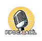

<h3 align="center" style="font-size: 36px;">Yan Monteiro </h3>

  <strong>Desenvolvedor Fullstack</strong>

  Desenvolvedor apaixonado por criar soluções completas e funcionais com foco em performance e experiência do usuário.  
  Trabalho com aplicações modernas tanto no frontend quanto no backend, utilizando tecnologias como ReactJS, NextJS, NodeJS e NestJS.

 

<h3> Experiência de trabalho </h3>

**Desenvolvedor Front end** \
[**Qa Coders**](https://www.linkedin.com/company/equipemetis/posts/?feedView=all) • Estágio \
Linguagens & Tecnologias: _`Next.js`_,_`TypeScript`_, _`Tailwind`_,_`Git`_,_`GitHub`_,_`React Hook Form`_,_`Zod`_.\
Projetos em destaque: [`Conectando Leitores`]()
 

**Desenvolvedor Front end** \
[**Metis**](https://www.linkedin.com/company/equipemetis/posts/?feedView=all) • Voluntario \
Linguagens & Tecnologias: _`Next.js`_,_`TypeScript`_, _`Tailwind`_,_`Zustand`_,_`Git`_,_`GitHub`_,.\
Projetos em destaque: [`Educagil`]()
 

**Desenvolvedor Front end** \
[**Pipoca Agil**](https://pipocaagil.com.br/) • Freelance \
Linguagens & Tecnologias: _`Next.js`_,_`TypeScript`_,_`Tailwind`_,_`Zustand`_,`Git`_,_`GitHub` .\
 

<h1></h1>

<h3> Formação Acadêmica </h3>

  
**Análise e Desenvolvimento de Sistemas**  
[**Estácio**](https://www.estacio.com.br/) • Graduação  
Linguagens & Tecnologias: _`Html`_, _`Css`_, _`JavaScript`_, _`TypeScript`_, _`React`_, _`Zustand`_, _`Redux`_, _`Sql`_, _`NoSql`_, _`JAVA`_, _`Python`_.  
 

  
**Curso de Inglês - Formação Completa**  
[**CCAA**](https://www.ccaa.com.br/)  
Habilidades Desenvolvidas: _`Leitura`_, _`Escrita`_, _`Conversação`_, _`Gramática`_, _`Tradução`_, _`Interpretação de Texto`_.  
 

<h1></h1>

<h3> Experiência com as tecnologias </h3>

  
  
  
  
  
  
  
  
  
  

<h1></h1>

<h3> Conhecimentos em destaque</h3>

- React com Zustand e Redux para controle de estados
- JavaScript e TypeScript como linguagens principais
- ReactJS e NextJS para aplicações fullstack modernas
- NodeJS e NestJS como frameworks backend
- Banco de dados: PostgreSQL e MySQL
- Estilização com Tailwind CSS
- Versionamento com Git
- Integração com APIs REST

<h1></h1>

<h3> Estatísticas GitHub</h3>

  

  

